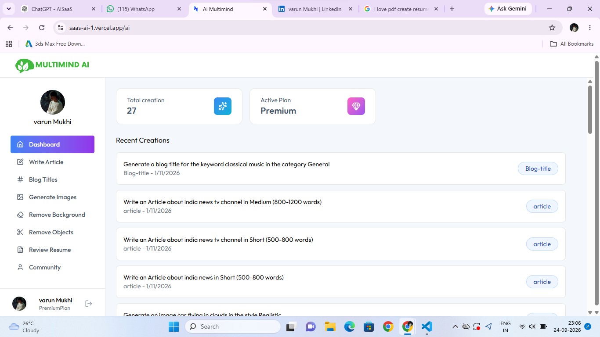

# Multimedia AI

> An AI-powered SaaS platform that provides multiple AI tools through a single web application.

## 🌐 Live Demo

Multimedia AI: https://saas-ai-1.vercel.app/

## 📂 GitHub Repository

https://github.com/varun222121/Saas-AI-

---

## 📖 Overview

Multimedia AI is a full-stack AI-powered SaaS platform that brings multiple AI-powered productivity and content creation tools together in a single web application.

Instead of switching between different platforms for different tasks, users can access multiple AI tools from one centralized platform.

The platform currently provides tools for:

- Article writing
- Blog title generation
- AI image generation
- Background removal
- Resume review
- Creator community

---

## 🎯 Problem Statement

With the growing number of AI tools available for different tasks, users often need to switch between multiple platforms to complete their work.

For example, a user may need one tool for writing articles, another for generating images, another for reviewing a resume, and another for removing image backgrounds.

Multimedia AI aims to bring these capabilities together into one platform, providing users with a centralized environment for AI-powered content creation and productivity.

---

## 💡 Solution

Multimedia AI combines multiple AI-powered tools into a single SaaS platform.

Users can:

1. Create an account or log in.
2. Access the dashboard.
3. Select an AI tool.
4. Provide a prompt or upload the required input.
5. Send the request through the application.
6. Receive the generated result.

The platform also provides a community section for creators to share and explore content.

---

## ✨ Features

### 📝 Article Writing

Generate AI-assisted articles based on user-provided topics or instructions.

### 📰 Blog Title Generation

Generate creative and relevant titles for blog posts and articles.

### 🎨 AI Image Generation

Generate images using AI based on user-provided prompts.

### 🖼️ Background Removal

Remove backgrounds from images using AI-powered processing.

### 📄 Resume Review

Analyze resumes and provide AI-assisted feedback to help users improve their resumes.

### 👥 Creator Community

A community section where creators can share, explore, and interact with content.

### 🔐 User Authentication

User authentication and account management are handled using Clerk.

---

## 🛠️ Tools & Technologies

### Frontend

- React
- Vite
- Tailwind CSS

### Backend

- Node.js
- Express.js
- REST APIs

### Authentication

- Clerk

### Database

- Neon Database
- PostgreSQL

### AI

- Google Gemini API

### Deployment

- Vercel

---

## 🏗️ System Architecture

Multimedia AI follows a client-server architecture.

```text
                    ┌─────────────────┐
                    │      User       │
                    └────────┬────────┘
                             │
                             ▼
                    ┌─────────────────┐
                    │   React + Vite  │
                    │    Frontend     │
                    └────────┬────────┘
                             │
                             ▼
                    ┌─────────────────┐
                    │  Express.js API │
                    │     Backend     │
                    └───────┬─┬───────┘
                            │ │
                  ┌─────────┘ └─────────┐
                  ▼                     ▼
          ┌───────────────┐     ┌───────────────┐
          │   Gemini API  │     │ Neon Database │
          │      AI       │     │  PostgreSQL   │
          └───────────────┘     └───────────────┘
```
## 🔄How the Application Works

```
The basic workflow of the application is:

User

  ↓

Login / Sign Up using Clerk

  ↓

Access Dashboard

  ↓

Select an AI Tool

  ↓

Enter Prompt / Upload Input

  ↓

Frontend sends request to Backend

  ↓

Express.js API processes request

  ↓

AI API / Database

  ↓

Generated Result

  ↓

Result displayed to User
```

## 📁 Project Structure
```
The project is divided into frontend and backend components.

Saas-AI/

│

├── Saas Ai/

│   ├── src/

│   ├── public/

│   ├── package.json

│   └── ...

│

├── server/

│   ├── ...

│   └── package.json

│

├── .gitignore

├── GET_TOKEN_INSTRUCTIONS.md

└── README.md

```

## 📥 Installation

1. Clone the repository

git clone https://github.com/varun222121/Saas-AI-.git

2. Navigate to the project

cd Saas-AI-

3. Install frontend dependencies

Navigate to the frontend directory:

cd "Saas Ai"

Install the dependencies:

npm install

4. Start the frontend

npm run dev

## ⚙️ Backend Setup

Open another terminal and navigate to the backend:

cd server

Install the backend dependencies:

npm install

Start the backend:

npm run dev

## 🔐 Environment Variables

VITE_CLERK_PUBLISHABLE_KEY=your_clerk_publishable_key

GEMINI_API_KEY=your_gemini_api_key

NEONDATABASE_URI=your_neon_database_connection_string


## 🖥️ Dashboard

The application provides a centralized dashboard where users can access the available AI tools.

The dashboard provides access to:

- Article Writing

- Blog Title Generation

- Image Generation

- Background Removal

- Resume Review

- Creator Community

- Screenshots

- Screenshots of the application can be added here:

docs/
    ├── landing-page.png

    ├── dashboard.png

    ├── article-generator.png

    ├── image-generator.png

    └── resume-review.png

Example:



## 📊 Results

Multimedia AI successfully integrates multiple AI-powered features into a single full-stack web application.

The project demonstrates the implementation of:

- AI-powered content generation

- AI image generation

- Image processing

- Resume analysis

- User authentication

- REST API communication

- Database integration

- Frontend and backend integration

- Cloud deployment

The application is deployed and accessible through Vercel.

## 🧠 What I Learned

Building Multimedia AI helped me gain practical experience in full-stack application development.

Key learning outcomes include:

Building a full-stack web application

Developing REST APIs

Implementing authentication using Clerk

Integrating AI APIs

Working with databases

Connecting frontend and backend services

Managing environment variables

Deploying a web application

Structuring a SaaS application

## 🔮 Future Improvements

The following improvements can be added in future versions:

Payment and subscription system

Multiple AI model integrations

Usage analytics

Improved user interface and user experience

Mobile application

Additional AI-powered tools

User usage and generation history

## ⚠️ Limitations

The current version is primarily focused on demonstrating the core functionality of the platform.

Future versions can improve scalability, subscription management, analytics, and the overall user experience.

## 👨‍💻 Author

Varun Mukhi

Computer Science Student | AI Enthusiast

Connect With Me

GitHub: https://github.com/varun222121

LinkedIn: www.linkedin.com/in/varun-mukhi-09715125a
